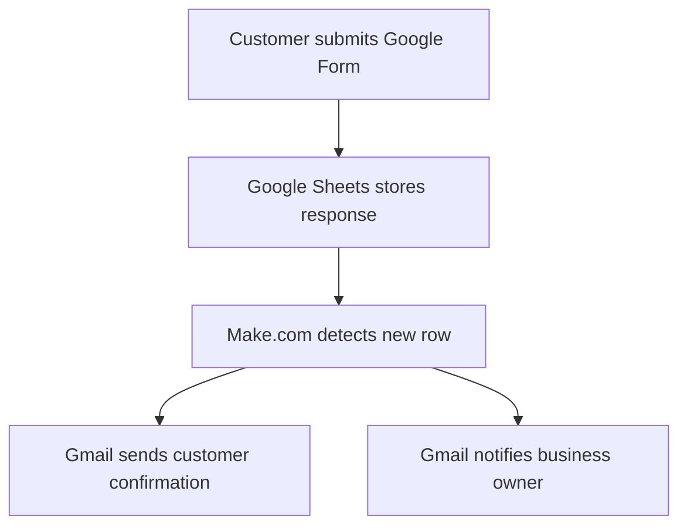

# Workflow Architecture

```mermaid
flowchart TD
    A[Customer submits Google Form] --> B[Google Sheets stores response]
    B --> C[Make.com detects new row]
    C --> D[Gmail sends customer confirmation]
    C --> E[Gmail notifies business owner]
```
